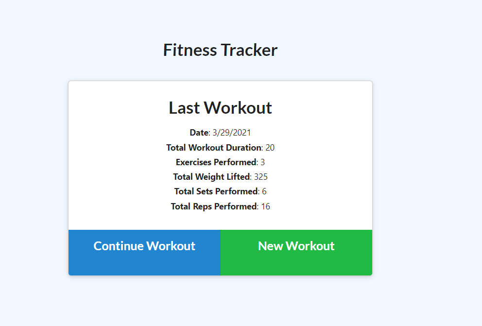
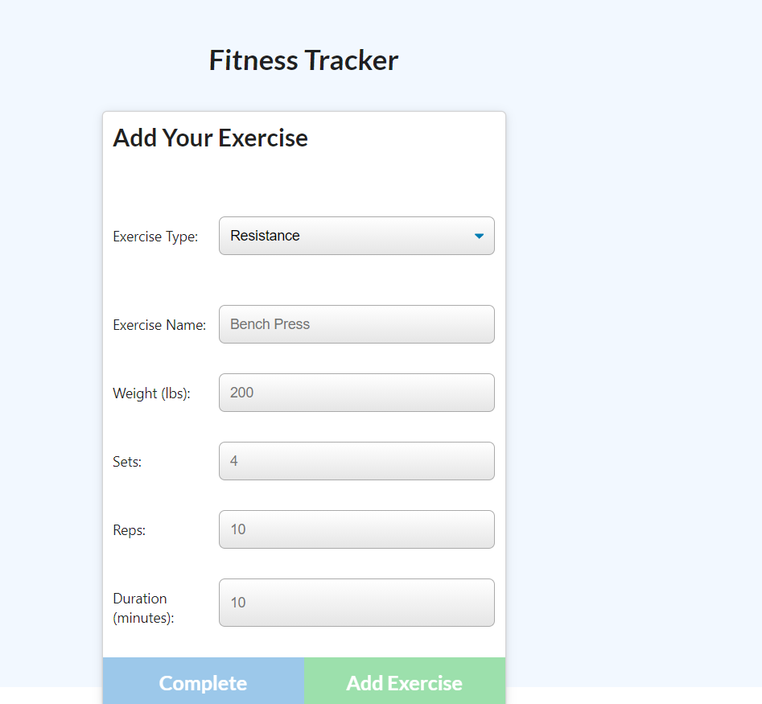
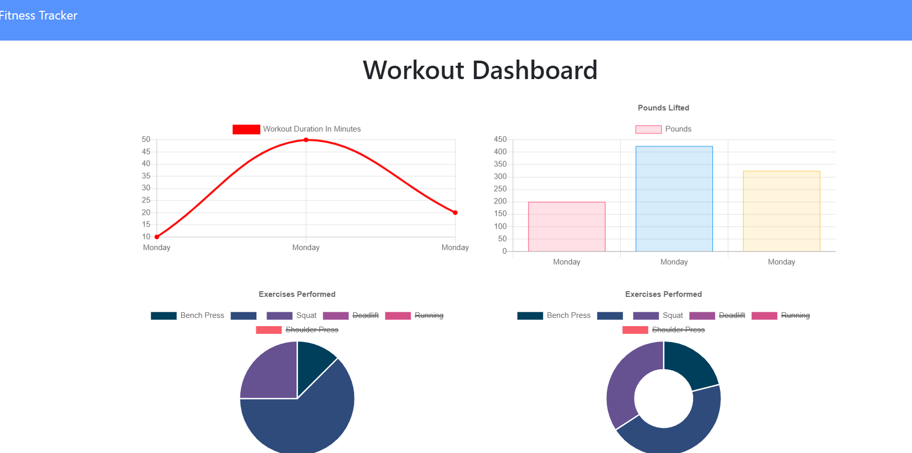

# Workout-Tracker

## Description 
The application allows the user to track their workouts and log the activities that each workout contains. After posting their information, the user can view all of their workouts over time, as a fraction of their total workout, and the sum of weight lifted each day. This information is stored in a MongoDB database.

## Screenshots

## Deployed Application
View the application here : https://workout-tracker-bootcamp.herokuapp.com/?id=606236a22f38950015563452